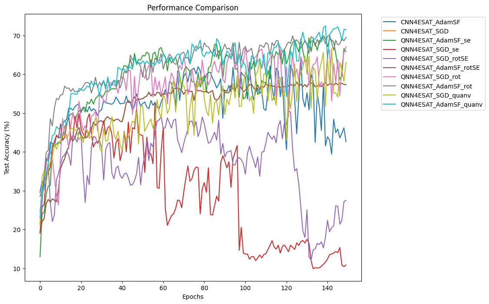
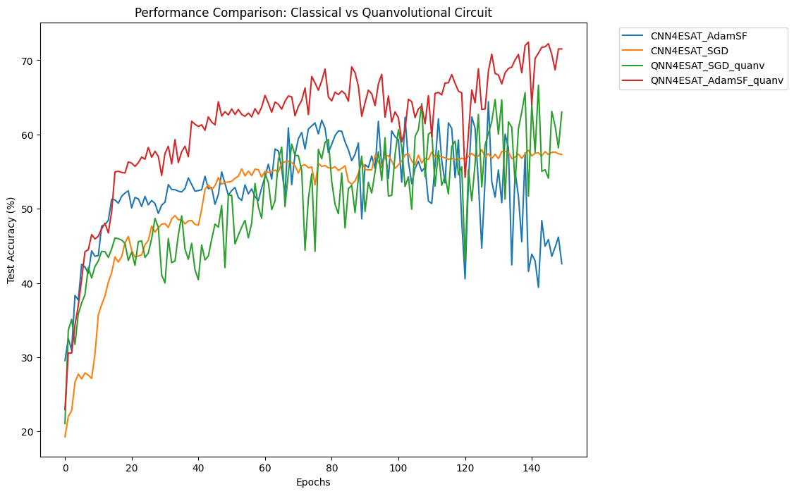
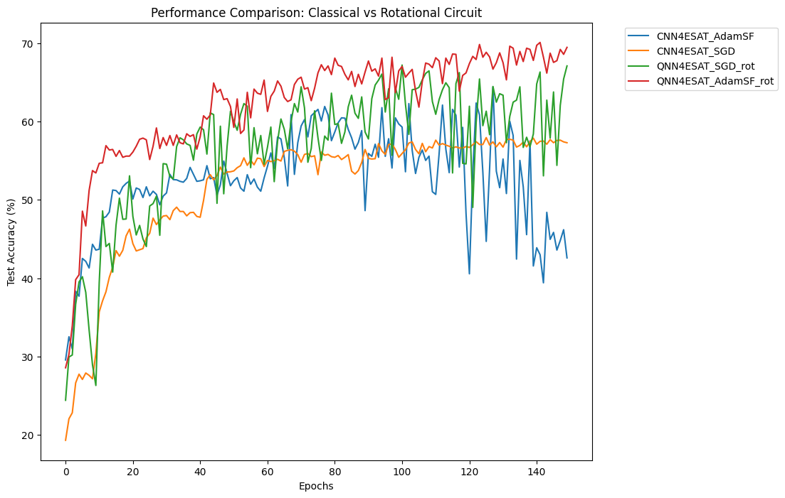
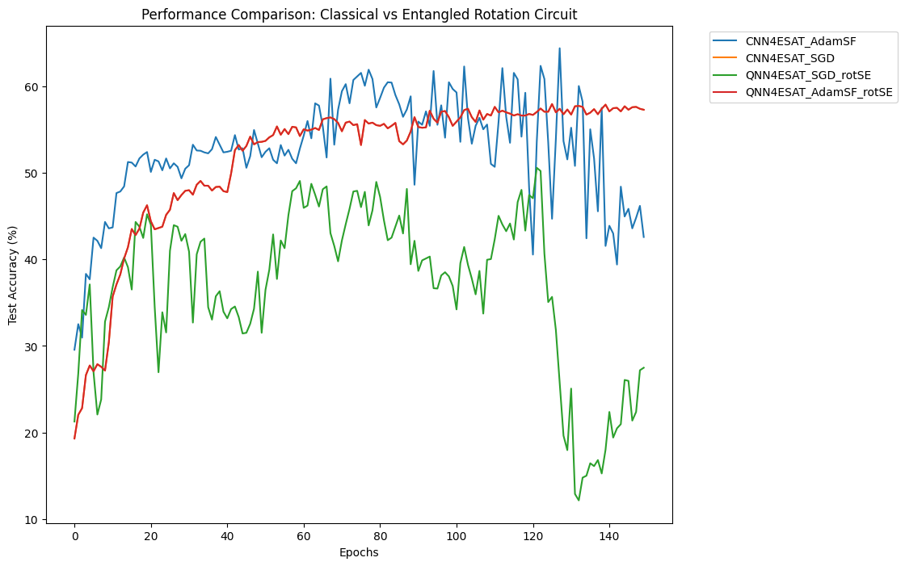
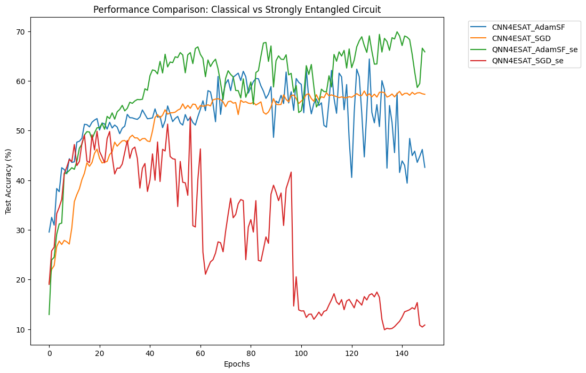

# eurosat-qml-classification
 
 # Performance comparisons

## Classical vs Quanvolutional Circuit

## Classical vs Rotational Circuit

## Classical vs Entangled Rotational Circuit

(for some reason the one of the classical CNNs isn't plotted if we include the `rotse` circuits)

## Classical vs Strongly Entangled Circuit

